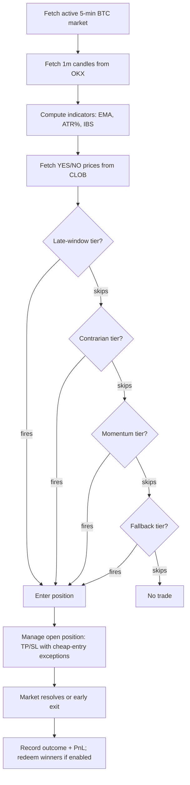

# Deep Research Review of Your 5‑Minute Polymarket Crypto Strategy and 5‑Minute Wallet Competitors

## Executive summary

Your current system is a **BTC 5‑minute direction bot** built around a **tiered signal stack (late‑window → contrarian → momentum → fallback)** using **1‑minute BTC‑USDT candles from entity["company","OKX","crypto exchange"]** to compute **EMA, ATR%, and IBS**, with **one trade per 5‑minute window** and rule‑based **take‑profit at 0.85** and **stop‑loss at 0.25** (plus special handling for very cheap entries). fileciteturn1file3

In 5‑minute crypto markets, the single most important structural constraint is that **taker fees are enabled** and follow a fee curve that **peaks at 1.56% at 50% probability** and declines toward the extremes; makers are eligible for **daily USDC rebates** funded by those taker fees. citeturn1search2turn0search0 This aggressively penalizes “mid‑price taker” trading and generally rewards either (a) true edge models that clear fees and spread consistently, or (b) **maker/hybrid execution** that captures spread and rebates.

Your competitor dataset (5 wallets, **14,375 5‑minute crypto trades**, Feb 20–Mar 6, 2026 UTC) shows a clear split between:
- **hyper‑active wallets** averaging **~16–21 USDC per trade** but doing **~18–20+ trades per 5‑minute window** (median ~2 seconds between trades), suggesting automation designed for **depth/flow participation** rather than “one‑shot” entries; and  
- a **whale wallet** with **median $200/trade** and **~1 trade per window**, closer to a discretionary or “selective sniper” profile.

Across these wallets, most trades cluster around **0.45–0.65 entry prices** (around the **highest fee region** if taker), and the estimated taker fee drag (worst case) is roughly **~0.9%–1.1% of notional**—large enough that a strategy can be directionally “right” and still lose net if it pays fees + spread without sufficient edge. citeturn0search0turn1search1

The highest‑leverage improvements are therefore:

- **Shift the objective function** from “signal fires → trade” to **fee‑ and spread‑adjusted EV gating** (only trade when modeled edge clears execution costs with margin). citeturn1search1turn0search0  
- **Instrument per‑trade outcomes** (entry/exit, realized P&L, fees, slippage, latency) using the logging structure your docs already specify; without those, Sharpe/Sortino/profit factor remain **uncomputed by necessity**. fileciteturn1file2  
- **Match competitor microstructure** where it matters: either become **maker‑eligible** (post‑only quoting, tight cancel/replace, inventory limits) or remain a taker only when the edge is unusually strong (late‑window mispricing that still clears fees). citeturn0search0turn2search9  
- Turn on and calibrate your **model‑as‑oracle filter** (digital probability / “fair value”) for contrarian bets to reduce low‑EV contrarian entries. fileciteturn1file1  

## Strategy baseline from your documentation

### Market definition and signal stack

Your bot targets **“Bitcoin Up or Down – 5 Minutes”** markets (YES wins if BTC closes at or above its window open; NO otherwise). fileciteturn1file3 The decision engine is a **hybrid tier system**:

- **Late‑window** logic in the last window segment (configured as last 90 seconds) that trades only when BTC has moved sufficiently from the window start and the market price is still below a cap (avoid “99¢ trap”). fileciteturn1file3  
- **Contrarian** logic aiming to buy the “cheap side,” using **IBS** extremes and ATR filters; optionally gated by a **model‑implied probability edge** (implemented, off by default). fileciteturn1file3turn1file1  
- **Momentum** logic using **EMA fast/slow**, breakout/breakdown conditions, a price band (e.g., 0.35–0.65), and IBS confirmation. fileciteturn1file3turn1file5  
- **Fallback** logic (IBS‑only or weak trend) intended to increase trade frequency when the higher tiers skip. fileciteturn1file3  

### Indicators and data inputs

You compute indicators from **OKX 1‑minute BTC‑USDT candles** and derive **EMA, ATR%, and IBS**. fileciteturn1file3turn1file5 The entity["company","OKX","crypto exchange"] official API supports `GET /api/v5/market/candles` with `bar=1m` for candlesticks. citeturn3search0

### Position sizing and risk controls

Your risk system includes:
- **One position at a time**, with **one trade per 5‑minute window** (configurable). fileciteturn1file3  
- Daily controls: `daily_trades` cap and a **max daily loss** stop. fileciteturn1file3  
- A compounding option where size is a fraction of implied bankroll, clamped to min/max. fileciteturn1file3  

### Exit rules and redeem mechanics

You implement **TP/SL** rules on the order book (TP if bid ≥ 0.85; SL if bid ≤ 0.25), plus “cheap entry” special cases (e.g., no SL below a threshold, hold to resolution for very cheap entries). fileciteturn1file3turn1file4

You also have automated **redeem/claim** logic (polymarket‑apis–based) to convert winning outcome tokens back into USDC for reinvestment. fileciteturn1file0 This is operationally important for capital efficiency in high‑frequency strategies.

## Methodology and data sources

### What was provided and what was missing

**Authoritative strategy description sources (your docs):**
- Architecture, tiers, config calibrations, and paper‑run observations. fileciteturn1file3turn1file5turn1file4  
- “Model‑as‑oracle” contrarian filter design (digital probability/fair value framing). fileciteturn1file1  
- Logging schema for per‑trade and per‑signal evaluation (needed to compute Sharpe/Sortino). fileciteturn1file2  
- Redeem workflow (capital recycling). fileciteturn1file0  

**Trade/competitor dataset (your CSV):**
- `polymarket_trades_2026-03-06.csv`: 14,375 trades in 5‑minute crypto “Up or Down” markets across 5 wallets (BTC/ETH/SOL/XRP), Feb 20–Mar 6, 2026 UTC (plus a few non‑5‑minute records that were filtered out).  
- The dataset includes time, wallet, side (BUY/SELL), outcome token, price, and notional—and is sufficient to compute **frequency, timing, sizing, and pricing behavior**, but **does not include realized P&L**.

**Missing for full performance analytics (required for equity curve, drawdown curve, return distributions, Sharpe/Sortino):**
- A ledger that includes **exits and realized P&L** (or confirmed market resolution outcome per entry), including fee and slippage attribution.  
Your own logging design explicitly supports this via `trades_24h.csv` and an entry‑signal file join on `condition_id`. fileciteturn1file2

### Primary/official reference sources used for market structure

- Polymarket fees/rebates for 5‑minute crypto: fee table and maker rebate percent, plus the fact that fees are highest near 50% probability. citeturn0search0turn1search0  
- Fee handling for API users: **fee curve formula**, dynamic `fee-rate` endpoint, and order parameter requirements. citeturn1search1  
- “5‑Minute Crypto Markets” launch and fee enablement (Feb 12, 2026). citeturn1search2  
- API surface: Gamma, Data API, and CLOB API domains. citeturn3search2  
- Data API trade query defaults (`takerOnly` default `true`), relevant when pulling competitor histories. citeturn0search8  
- Real‑time price feeds via Polymarket RTDS (crypto prices from entity["company","Binance","crypto exchange"] and entity["company","Chainlink","blockchain oracle network"], WebSocket endpoint). citeturn2search2turn2search3  
- Heartbeat / order safety mechanisms for managing resting orders (important for maker strategies). citeturn2search9  

### Competitor selection rule applied

Because no competitor set was specified, competitors were defined as:

- **Highly active 5‑minute wallets** from your dataset (5 wallets). These are definitively active in 5‑minute markets by construction.
- **Top public “Crypto” leaderboard accounts** on Polymarket (weekly and monthly) to represent broader “best‑in‑category” performance, with the explicit caveat that leaderboards are category‑level and not guaranteed to be 5‑minute‑only. citeturn0search2turn0search6  

## Competitor set and comparative metrics

### Top public competitors from Polymarket leaderboards

Polymarket’s **Weekly Crypto** leaderboard shows multiple accounts with **>$100k weekly profit**, including address‑style usernames (wallet‑linked identities) as the top entries. citeturn0search2 **Monthly Crypto** similarly shows several accounts with **>$250k–$500k+ monthly profit**. citeturn0search6

These are important “macro competitors,” but they are not directly “5‑minute only,” so they should be used primarily as **north‑star performance ceilings**, not as direct 5‑minute microstructure benchmarks. citeturn1search2turn0search6

### Highly active 5‑minute wallets from your dataset

The table below summarizes the 5 wallets in your dataset and captures the microstructure behaviors that matter for 5‑minute systems.

#### Wallet metrics comparison table

| Wallet | Trades | Unique 5m windows | Avg trades per window | Notional traded | Median trade | Median entry price | Buy share | In last 90s | Est. taker fees (worst-case) | Fee % of notional (worst-case) | BTC notional share | ETH notional share | SOL notional share | XRP notional share |
|---|---:|---:|---:|---:|---:|---:|---:|---:|---:|---:|---:|---:|---:|---:|
| 0x267c…e3fc | 3500 | 639 | 5.48 | $11,970 | $2.07 | 0.500 | 39.7% | 13.6% | $124.74 | 1.0% | 100.0% | 0.0% | 0.0% | 0.0% |
| 0x5d33…256e | 3500 | 191 | 18.32 | $72,524 | $21.60 | 0.550 | 100.0% | 29.3% | $754.02 | 1.0% | 100.0% | 0.0% | 0.0% | 0.0% |
| 0x6127…c977 | 3500 | 177 | 19.77 | $71,276 | $10.80 | 0.550 | 100.0% | 31.4% | $810.17 | 1.1% | 77.3% | 22.7% | 0.0% | 0.0% |
| 0xdb21…39ff | 3500 | 183 | 19.13 | $58,087 | $8.73 | 0.520 | 100.0% | 32.5% | $632.57 | 1.1% | 60.8% | 17.4% | 10.8% | 11.0% |
| 0xf32a…8c87 | 375 | 297 | 1.26 | $106,514 | $200.00 | 0.650 | 82.7% | 17.4% | $940.08 | 0.9% | 100.0% | 0.0% | 0.0% | 0.0% |

**How to read this table:**  
- “Avg trades per window” is the strongest proxy for whether a wallet is behaving like a **maker/flow‑participant** versus a “one‑shot entrant.”  
- “Est. taker fees (worst‑case)” applies the official effective fee curve to notional to show how large fee drag would be **if these were taker executions** (actual fee paid depends on maker/taker status and order type). citeturn1search1turn0search0

### Competitor timing profiles versus close

Competitors trade at materially different parts of the 5‑minute window; importantly, several wallets place **a meaningful share of trades in the last 90 seconds**, which overlaps your “late‑window” tier concept. fileciteturn1file3


A more detailed timing bucket table (share of **in‑window** trades by seconds‑to‑close bucket):

| Wallet | 0–30s | 30–60s | 60–90s | 90–120s | 120–180s | 180–240s | 240–300s |
|---|---:|---:|---:|---:|---:|---:|---:|
| 0x267c…e3fc | 2.6% | 4.3% | 6.7% | 8.1% | 20.3% | 28.6% | 29.4% |
| 0x5d33…256e | 7.3% | 18.3% | 5.8% | 7.2% | 14.0% | 23.2% | 24.2% |
| 0x6127…c977 | 12.2% | 9.7% | 9.5% | 8.9% | 15.7% | 20.4% | 23.4% |
| 0xdb21…39ff | 11.3% | 12.1% | 9.1% | 8.7% | 14.8% | 19.5% | 24.6% |
| 0xf32a…8c87 | 4.8% | 5.2% | 9.1% | 9.9% | 17.9% | 23.0% | 30.2% |

**Strategic implication:** your “one trade per window” approach is structurally different from competitors doing 15–20+ trades per window, and it should be evaluated as a different game: you need higher confidence per trade (or superior execution), because you are not harvesting spread repeatedly.

### Competitor entry price regimes

Most competitor trades cluster around **0.45–0.65**, meaning competitors are heavily interacting where the **fee curve is highest** for takers (around 0.50). citeturn0search0turn1search1


Price bucket table:

| Wallet | ≤0.10 | 0.10–0.15 | 0.15–0.25 | 0.25–0.35 | 0.35–0.45 | 0.45–0.65 | 0.65–0.90 | >0.90 |
|---|---:|---:|---:|---:|---:|---:|---:|---:|
| 0x267c…e3fc | 0.7% | 2.3% | 10.0% | 12.3% | 15.9% | 35.1% | 23.4% | 0.2% |
| 0x5d33…256e | 6.5% | 2.6% | 5.7% | 7.0% | 10.3% | 37.9% | 25.2% | 4.8% |
| 0x6127…c977 | 5.4% | 1.4% | 4.4% | 7.3% | 12.3% | 39.5% | 24.3% | 5.4% |
| 0xdb21…39ff | 4.0% | 2.0% | 6.9% | 11.1% | 12.2% | 35.9% | 23.6% | 4.3% |
| 0xf32a…8c87 | 1.1% | 0.5% | 1.9% | 3.2% | 4.0% | 39.7% | 32.3% | 17.3% |

**Strategic implication:** if these competitors are **makers**, clustering near 0.50 is rational (spread capture + rebates); if they are **takers**, it implies they believe they have an edge strong enough to overcome the maximal random‑walk‑like fee drag.

### Competitor sizing and automation intensity

A key behavioral signal is how frequently these wallets trade. Median time between trades is ~2 seconds for three wallets, consistent with an automated bot operating near the practical speed limits of real‑time market participation. (Your system’s loop interval is documented as 10 seconds in the architecture description.) fileciteturn1file3


## Fees, execution, and why 5‑minute edge must be cost‑aware

### Fee curve reality in 5‑minute crypto

5‑minute crypto markets launched with taker fees enabled, using the same curve as 15‑minute crypto, peaking at **1.56% effective rate at 50% probability**. citeturn1search2turn0search0

The Polymarket developer documentation expresses the fee curve (in shares) and directs builders to **fetch fee rate dynamically** and include it in order creation. citeturn1search1 The effective fee rate on trade value is:

\[
\text{effective fee rate} \approx 0.25 \cdot (p(1-p))^2
\]

where \(p\) is the share price (implied probability), with the maximum at \(p=0.5\). citeturn1search1turn0search0


### Break-even win probability rises above the entry price

If you buy YES at probability \(p\) as a taker, **fees increase your effective cost**, so the break‑even win probability is **higher than \(p\)** (even before spread/slippage). citeturn0search0turn1search1


**Strategic implication for your tiers:**
- Momentum entries (0.35–0.65) operate exactly where fee drag is large; they must be exceptionally selective or executed maker‑side to avoid systematic bleed. fileciteturn1file3  
- Contrarian cheap entries (≤0.25) face lower fee drag but need robust controls against “catching a falling knife,” which you are already addressing via volatility filters and special exit rules. fileciteturn1file3turn1file4  
- Late‑window entries face less fee drag at extreme prices but require **very high correctness** when buying near 0.90; your “avoid 99¢” intent matches this. fileciteturn1file5turn1file3  

### Maker rebates change the competitive frontier

The Maker Rebates program pays **daily USDC rebates** funded by taker fees; 5‑minute crypto is explicitly included with a published rebate percentage. citeturn0search0turn1search0

This strongly suggests that a sustainable high‑volume strategy in 5‑minute crypto often must be:
- **maker‑eligible** (post‑only liquidity provision) or  
- hybrid (maker most of the time, taker selectively). citeturn2search9turn0search0

Polymarket provides additional primitives that are specifically relevant for market making:
- **Heartbeats** for order safety (open orders canceled if heartbeat not received). citeturn2search9  
- Post‑only order support and order scoring eligibility (for rebates). citeturn2search9  

### Execution data feeds and latency alignment

Your current system uses OKX candles for indicators. fileciteturn1file3 Polymarket also offers RTDS crypto price feeds from **Binance** and **Chainlink** over WebSocket, which can be used for lower‑latency price alignment or cross‑validation. citeturn2search2turn2search3

**Practical implication:** Your “truth price” and your execution venue price can diverge; in 5‑minute markets, you should explicitly measure whether trades are triggered on stale or mismatched price inputs.

## Gap analysis and prioritized recommendations

The table below maps your current design to competitor behaviors and to Polymarket’s fee/rebate regime.

### Gap analysis table

| Attribute | Your current approach | Competitor evidence (5‑min wallets) | Gap | Recommendation | Priority |
|---|---|---|---|---|---|
| Entry/exit objective | Tiered signals; TP/SL rules; special cheap-entry handling fileciteturn1file3 | Many wallets do **15–20+ trades per window**, implying spread/flow capture vs one-shot directional entries | You’re playing “high‑confidence one-shot” while market is optimized for fee‑aware flow | Make EV gating explicit; either adopt maker/hybrid or tighten taker usage | Highest |
| Fee handling | Not described as dynamic fee‑rate fetch in the strategy doc | Fees are real and priced; maker rebates exist (5‑min crypto) | If feeRateBps isn’t fetched and applied correctly, execution can be wrong in fee-enabled markets | Implement dynamic fee fetching and correct buy/sell fee accounting per docs | Highest |
| Policy for mid‑probability trades | Momentum and fallback trade in the 0.30–0.65 ranges fileciteturn1file3 | Most competitor trades are 0.45–0.65 (peak fee region) | Midrange is costly for takers; you need either maker execution or very strong model edge | Limit taker in 0.45–0.65 unless predicted advantage clears fee+spread by a buffer | Highest |
| Contrarian quality control | IBS + cheap price band + volatility filter; optional model edge (off) fileciteturn1file1turn1file3 | Competitors do some cheap trades, but are mostly midrange | Contrarian can be high payoff but can become random knife-catching | Turn on model‑as‑oracle filter and calibrate MIN_EDGE; treat it as probability‑fairness arb | High |
| Fallback aggressiveness | Fallback exists to increase “action” fileciteturn1file3 | Competitors don’t need fallback; they can trade continuously | Fallback risks becoming a low‑EV trade generator | Greatly restrict fallback or require stronger edge; monitor per-tier expectancy | High |
| Risk per trade | Compounding with percent‑of‑bankroll option (values in doc imply high aggressiveness) fileciteturn1file3 | Competitors diversify style; one wallet uses whale sizing | 5‑minute drawdowns can be brutal if edge isn’t stable | Drop risk fraction until edge is proven; use risk units (R) and maximum DD stop | High |
| Automation & monitoring | Loop interval and paper/live separation; kill switch fileciteturn1file3 | Competitors trade every ~2 seconds in bursts | You may be “slow” if trying to pick off stale quotes as a taker | Use WebSockets where possible; add latency KPIs and auto-disable on stale data | Medium |
| Portfolio/capital recycling | Auto-redeem is implemented fileciteturn1file0 | Not observable from dataset | Good operational hygiene; keep it | Add redeem latency and unpaid settlement tracking to ops dashboard | Medium |

### Recommended strategy flows

#### Current strategy flow (as specified)



#### Recommended fee-aware hybrid flow (maker-first, taker-selective)

```mermaid
flowchart TD
  A[Identify market + window timing] --> B[Compute model fair probability q_hat]
  B --> C[Read order book (bid/ask) + tick size + fee-rate]
  C --> D[Compute EV after fees + spread + slippage buffer]
  D --> E{EV >= threshold?}
  E -- No --> Z[Stand down]
  E -- Yes --> F{Can we be maker?}
  F -- Yes --> G[Post-only quote(s):\n- inventory limits\n- cancel/replace\n- heartbeat]
  F -- No --> H[Taker entry (rare):\nstrict price cap + size cap]
  G --> I[Monitor fills, inventory, and scoring eligibility]
  H --> I
  I --> J[Exit logic:\n- resolution hold OR\n- TP/SL if net-positive after costs]
  J --> K[Log: latency, slippage, fees, realized PnL, tier, q_hat]
```

## Experiments, backtests, implementation checklist, and KPIs

### What can be computed today vs what is blocked

Your current competitor CSV is excellent for **behavioral benchmarking** (how others trade), but it cannot produce equity curves without outcomes. Your own logging design solves this.

| Metric | Status | Why |
|---|---|---|
| Entry/exit rules, indicators, sizing, risk rules | Complete | Fully described in your docs fileciteturn1file3turn1file5 |
| Trade frequency, timing, sizing behavior (competitors) | Computed | Available in `polymarket_trades_2026-03-06.csv` |
| Win rate, profit factor, expectancy | **Blocked** (for both you and competitors) | Missing per‑trade realized outcomes and exits; needs `trades_24h.csv` CLOSE rows joined to entries fileciteturn1file2 |
| Sharpe/Sortino, equity curves, drawdowns | **Blocked** | Requires time series of realized returns (per trade or per day) fileciteturn1file2 |
| Slippage and execution latency | **Partially blocked** | Needs decision timestamp, submit timestamp, fill timestamp, and book snapshots at decision/fill |

### Suggested experiment grid and parameter ranges

Your own post‑analysis already points to “price bucket matters,” “fallback can overtrade,” and “stop loss for cheap entries can be harmful,” which should be formalized into controlled experiments. fileciteturn1file4turn1file3

| Experiment | What to vary | Parameter ranges to test | Primary success metrics | Notes |
|---|---|---|---|---|
| Enable model‑as‑oracle contrarian filter | `CONTRARIAN_USE_MODEL_FAIR_VALUE`, `CONTRARIAN_MIN_EDGE` | MIN_EDGE: 0.02, 0.03, 0.05, 0.07 | Expectancy per trade, win/loss tail | Implemented but off; should reduce low‑EV contrarian bets fileciteturn1file1 |
| Recalibrate contrarian cheap band | `CONTRARIAN_MAX_PRICE`, IBS thresholds | Max price: 0.20–0.30; IBS bounce/fade: 0.20–0.30 / 0.70–0.80 | Profit factor, worst‑5% loss | Your log memo suggests cheaper is better fileciteturn1file4 |
| Make SL/TP dynamic by entry price | SL/TP functions instead of constants | SL = max(0.25, k·entry) with k∈[0.3,0.8]; TP bands by entry | Reduction in “small entry stopped out,” net EV | Motivated directly by your observation of cheap entries vs SL fileciteturn1file4turn1file3 |
| Reduce fallback participation | Tighten fallback price/IBS bands or require edge | Price band: 0.30–0.45; IBS: 0.10–0.20 / 0.80–0.90 | Expectancy gap between fallback vs others | You already narrowed fallback to reduce marginal trades fileciteturn1file4 |
| Momentum robustness | EMA lengths; breakout rules; ATR gating | EMA pairs: (8,21), (10,30), (12,36); ATR% threshold: 2–4% | Hit rate at mid prices; realized EV after fees | Midrange trades are fee‑expensive; must be truly predictive citeturn0search0turn1search1 |
| Maker-first execution pilot | Post-only quoting, cancel/replace cadence | Quote cadence 0.5–2.0s; inventory caps; heartbeat | Spread capture, rebate eligibility, realized P&L | Requires correct heartbeat + scoring checks citeturn2search9turn0search0 |

### Numbered implementation checklist

1. **Implement per‑trade outcome logging exactly as designed**: write OPEN and CLOSE rows with `pnl_usdc`, `cumulative_pnl_usdc`, and `current_balance_usdc`, and ensure every entry has a `condition_id` suitable for joining. fileciteturn1file2turn1file3  
2. **Add a trade‑entry states table** (`trade_entries_24h.csv`) capturing: tier, indicator snapshot, `secs_remaining`, and the “signal_reason” string so you can compute per‑tier expectancy. fileciteturn1file2turn1file3  
3. **Add “all signals evaluated” logging** so you can measure opportunity cost (good trades skipped vs bad trades taken) and explainability of blocks. fileciteturn1file2  
4. **Implement fee‑aware order creation**:
   - fetch fee rate from the CLOB fee‑rate endpoint as documented and set `feeRateBps` on orders,  
   - compute expected fee drag per candidate trade before submitting,  
   - store expected vs realized fee in logs where possible. citeturn1search1turn0search0  
5. **Introduce an EV gate**: do not trade unless the modeled advantage exceeds (fee + spread + slippage buffer) by a configurable margin. citeturn1search1turn0search0  
6. **Turn on the contrarian model‑as‑oracle filter** and run an A/B test: baseline contrarian vs model‑filtered contrarian, holding everything else constant. fileciteturn1file1  
7. **Tighten or disable fallback** until it proves positive expectancy under the EV gate. fileciteturn1file4turn1file3  
8. **Pilot maker-first mode** in a limited risk sandbox:
   - implement post‑only quoting,  
   - heartbeats to keep orders safe,  
   - inventory caps and a kill switch if data is stale. citeturn2search9turn0search0  
9. **Operationalize capital recycling**: keep auto‑redeem enabled but add “redeem latency” and “stuck claim” monitoring (capital utilization is critical at 5‑minute cadence). fileciteturn1file0  

### KPI dashboard table to track continuously

| KPI | Definition | Why it matters in 5‑minute markets |
|---|---|---|
| Expectancy (per trade) | Avg realized P&L per trade | Single best scalar for whether you have edge |
| Profit factor | Gross profit / gross loss | Detects “high win rate, low payout” traps |
| Win rate by entry price bucket | Win% conditioned on entry price | Fees + payout asymmetry depend on entry price citeturn0search0 |
| EV margin at entry | \(q\_{hat} - (p + cost\_buffer)\) | Enforces trading only when edge clears costs |
| Fee drag (realized) | Paid fees / notional | Confirms whether you’re operating as maker vs taker citeturn1search1 |
| Slippage | Fill price vs decision mid/best | Quantifies execution quality |
| Latency | decision→submit→fill | 5‑minute microstructure punishes stale decisions |
| Tier contribution | P&L and expectancy by tier | Lets you prune or refit tiers fileciteturn1file3turn1file2 |
| Max intraday drawdown | Peak‑to‑trough equity loss per day | Required to enforce survival constraints |
| Capital utilization | % of time capital is idle/unredeemed | Matters when recycling wins quickly fileciteturn1file0 |

### Notes on extending beyond BTC or beyond 5‑minute direction

You have a separate “Polymarket vs options” arbitrage module for longer‑dated markets (not used for BTC 5‑minute direction). fileciteturn1file6 That module can remain logically separate, but the same discipline applies: **fee‑aware EV gating + outcome‑linked logging + execution measurement**.

If you later expand from BTC‑only to multi‑asset 5‑minute markets (ETH/SOL/XRP appear in the competitor set), your KPI layer should add **cross‑asset correlation** and **shared drawdown** controls, because the underlying crypto assets are often correlated over short horizons.

